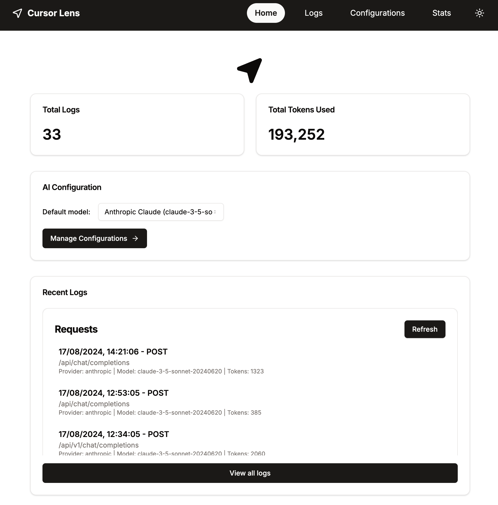
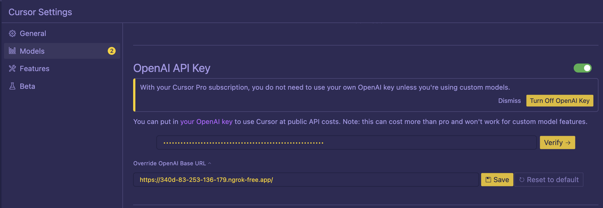
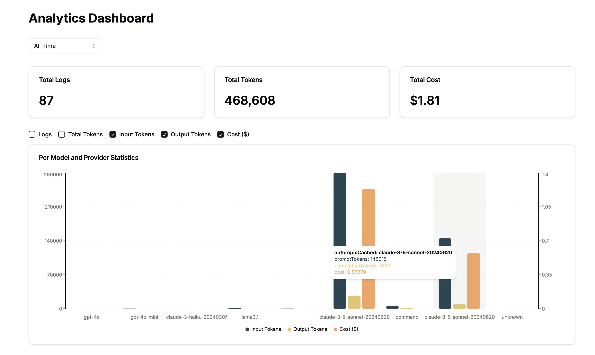
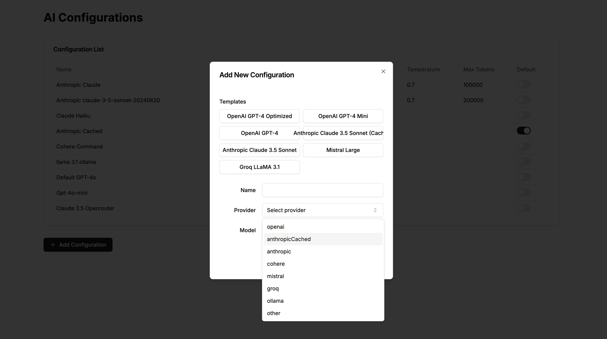
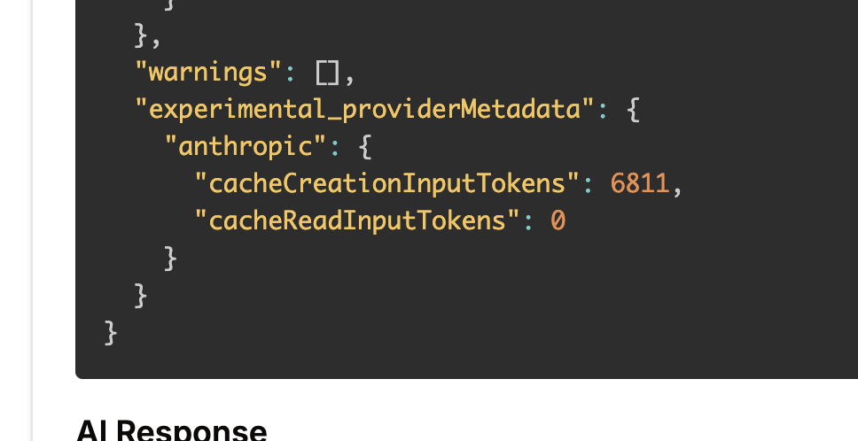
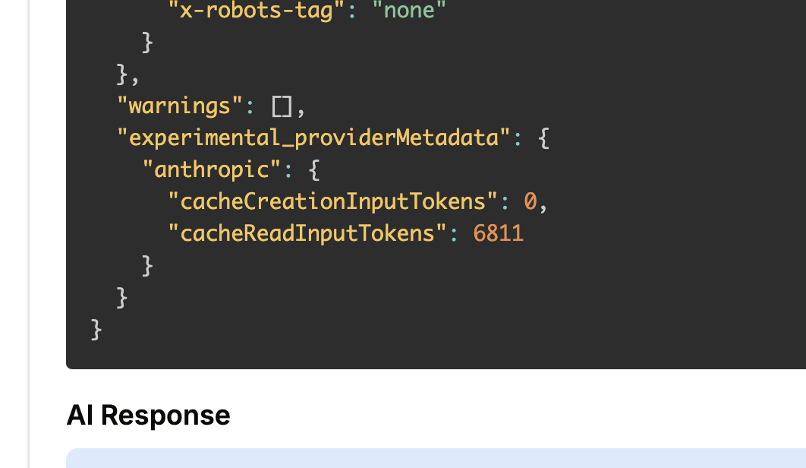

# Cursor Lens ✨

Cursor Lens is an open-source tool designed to provide insights into AI-assisted coding sessions using Cursor AI. It acts as a proxy between Cursor and various AI providers, logging interactions and providing detailed analytics to help developers optimize their use of AI in their coding workflow.

We are live on ProductHunt today, please upvote us if you find this useful! 🙏

## Features

- **AI Provider Integration**: Supports multiple AI providers including OpenAI, Anthropic, and more.
- **Request Logging**: Captures and logs all requests between Cursor and AI providers.
- **Analytics Dashboard**: Provides visual analytics on AI usage, including token consumption and request patterns.
- **Configurable AI Models**: Allows users to set up and switch between different AI configurations.
- **Real-time Monitoring**: Offers a live view of ongoing AI interactions.
- **Token Usage Tracking**: Monitors and reports on token usage across different models.
- **Cost Estimation**: Provides estimated costs based on token usage and model pricing.

## Technology Stack

- **Frontend/Backend**: Next.js with React
- **Database**: PostgreSQL with Prisma ORM
- **AI Library**: Vercel AI SDK
- **Styling**: Tailwind CSS with shadcn/ui components

## Getting Started

For detailed installation instructions, please refer to our [Installation Guide](https://www.cursorlens.com/docs/getting-started/installation).

### Prerequisites

- Node.js (v14 or later)
- pnpm
- PostgreSQL
- ngrok

### Quick Installation Steps

1. Clone the repository
2. Install dependencies with `pnpm install`
3. Set up environment variables
4. Set up the database with `pnpm prisma migrate dev`
5. Build the project with `pnpm build`
6. Set up ngrok
7. Configure Cursor to use your ngrok URL as the API endpoint

For full details on each step, please see the [Installation Guide](https://www.cursorlens.com/docs/getting-started/installation).

## Usage

1. Configure Cursor to use Cursor Lens as its API endpoint by overriding `OpenAI Base URL`.
2. Choose a `gpt-` model. Use Cursor as normal for AI-assisted coding.
3. Visit the Cursor Lens dashboard to view logs, statistics, and insights.

## Stats page

## Prompt caching with Anthropic (v0.1.2):

1. Create a new config on `/configuration` page, choose `antropicCached` with Sonnet 3.5. Name it as you like.
2. Mark it as default.
3. Use Cursor with CursorLens as normal. The system and context messages in `CMD+L` and `CMD+i` chats will be cached from now on.

> Note that TTL for the cache is 5 minutes.

# Releases

## Nightly - 2024-08-24

- Add new cost calculation

To run it, make sure to run:

- `npx prisma seed db` and then
- `pnpm run update-log-costs` to add cost info in metadata for all previous logs

## [0.1.2-alpha] - 2024-08-22

### ⚠️ ALPHA RELEASE

### Added

- Add Anthropic Cache support for context messages
- Increase Token limit for Anthropic to 8192 tokens
- Improved statistics page: Now you can select the data points you want to see

### Improved and fixed

- Log details are now collapsible
- Full response is captured in the logs

## [0.1.1-alpha] - 2024-08-18

### ⚠️ ALPHA RELEASE

### Added

- Added support for Mistral AI, Cohere, Groq, and Ollama

## [0.1.0-alpha] - 2024-08-17

This is the initial alpha release of CursorLens. As an alpha version, it may contain bugs and is not yet feature-complete. Use with caution in non-production environments.

### Added

- Initial project setup with Next.js
- Basic proxy functionality between Cursor and AI providers (OpenAI, Anthropic)
- Simple dashboard for viewing AI interaction logs
- Token usage tracking for OpenAI and Anthropic models
- Basic cost estimation based on token usage
- Support for PostgreSQL database with Prisma ORM
- Environment variable configuration for API keys and database connection
- Basic error handling and logging

### Known Issues

- Limited error handling for edge cases
- Incomplete test coverage
- Basic UI with limited customization options
- Potential performance issues with large volumes of requests
- Cost calculation for cached messages in Anthropic are not correct

## Contributing

We welcome contributions to Cursor Lens! Please see our [Contributing Guide](CONTRIBUTING.md) for more details on how to get started.

## License

Cursor Lens is licensed under the GNU Affero General Public License v3.0 (AGPL-3.0). See the [LICENSE](LICENSE) file for details.

## Support

If you encounter any issues or have questions, please file an issue on the GitHub repository or contact the maintainers directly.

For more detailed information, please visit our [documentation](https://www.cursorlens.com/docs/project/introduction).

---

Happy coding with Cursor Lens!
